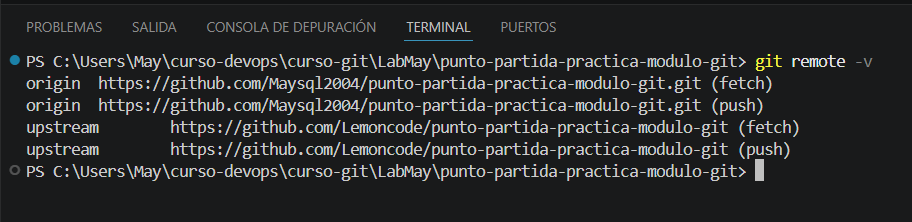
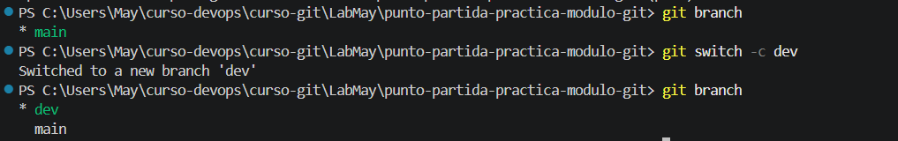
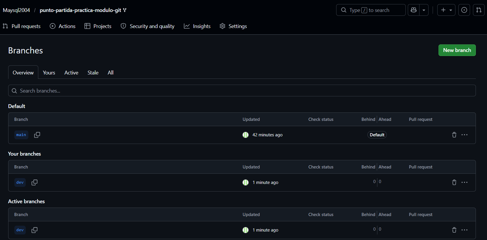
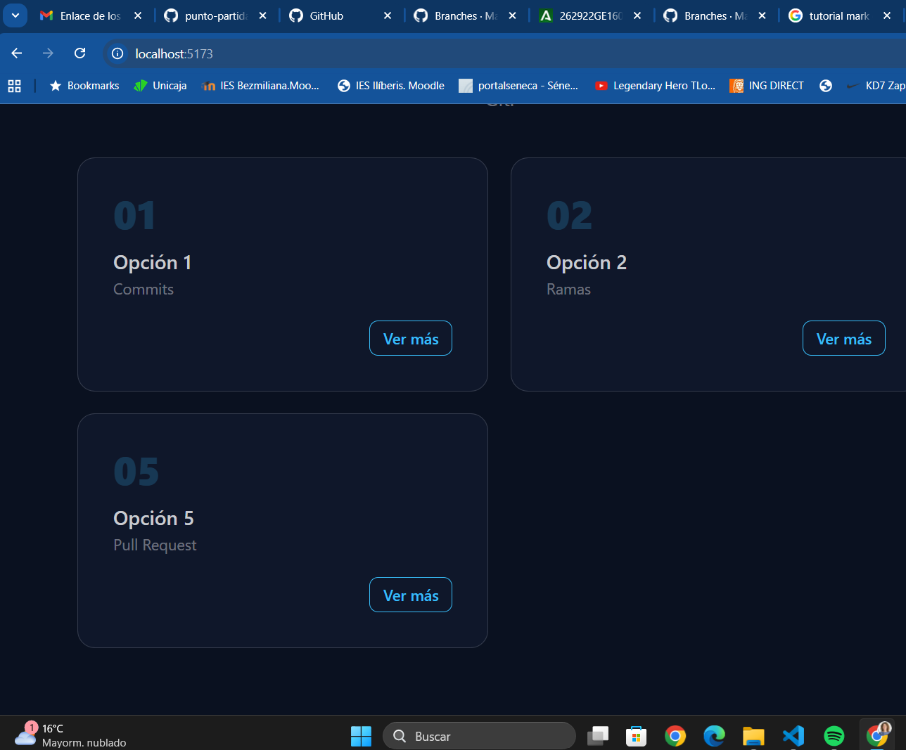
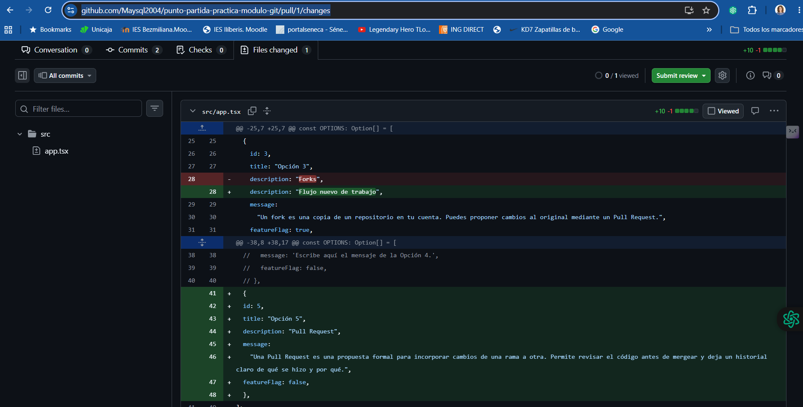
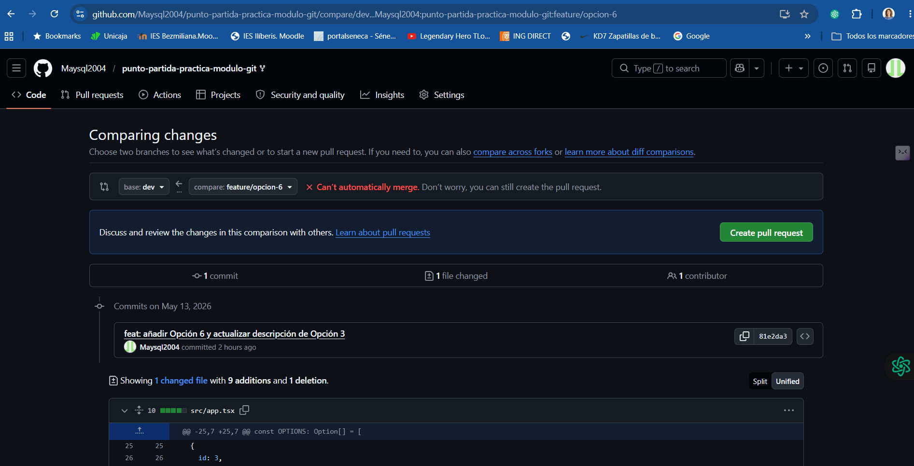
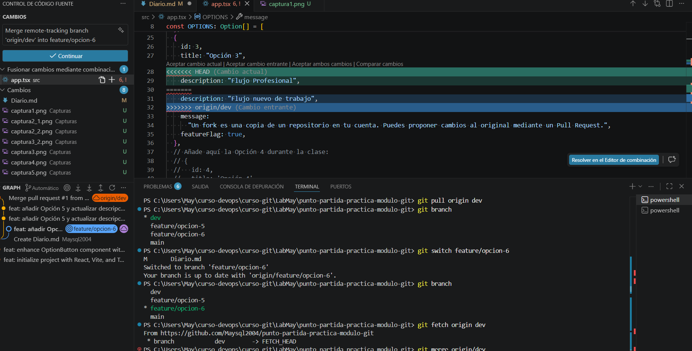
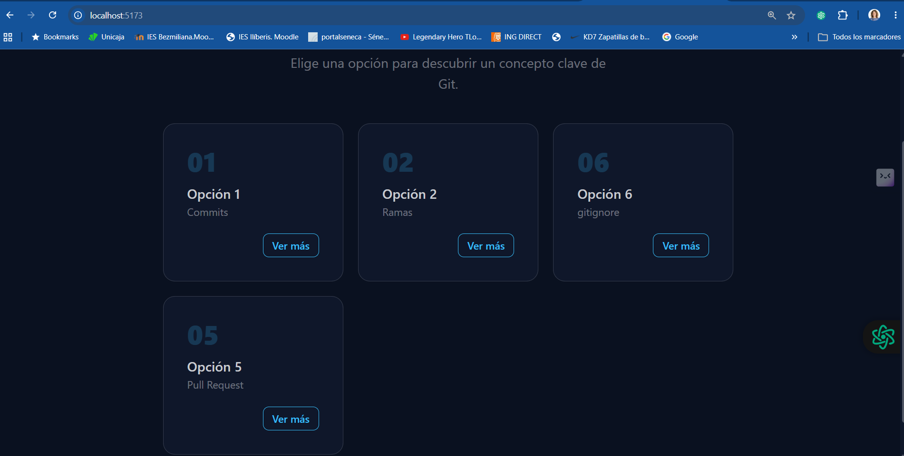

# TAREAS de GIT LAB:

## Tarea 1- Fork y configuración inicial
Un **fork** es una copia que se hace de un proyecto, aunque no es una copia totalmente independiente. La idea del fork es mantener una relación con el proyecto desde el que se hizo la copia. De esa forma, si hay un cambio en el proyecto original puedes aplicar dichos cambios a tu copia para mantenerla actualizada.

También se pueden hacer cambios en la otra dirección, se puede proponer que los cambios en tu copia del proyecto se apliquen al proyecto original. En git para interactuar con el proyecto original se configura su dirección como upstream. Cuando se hace un pull de **upstream**, te traes los cambios que se hicieron en el proyecto original desde que creaste el fork (o desde que hiciste el ultimo pull de upstream).

*Captura 1: Origin y Upstream:* muestra una terminal de comandos donde se ha ejecutado el comando `git remote -v`. Este comando se utiliza en Git para mostrar las direcciones URL de los repositorios remotos asociados a un proyecto.

1. **Ruta del Directorio**: La terminal está en el directorio `C:\Users\May\curso-devops\curso-git\LabMay\punto-partida-practica-modulo-git`, lo que indica que se está trabajando en un proyecto específico de Git.

2. **Comando Ejecutado**: `git remote -v` muestra dos listas de URLs:
   - `origin`: Se refiere al repositorio remoto principal desde donde se clona el proyecto. En este caso, hay dos entradas para `origin`, lo que podría ser un error o una configuración duplicada, ambas apuntando al mismo repositorio `https://github.com/Maysql2004/punto-partida-practica-modulo-git.git`.
   - `upstream`: Este es otro repositorio remoto, generalmente utilizado para referirse al repositorio original del cual se ha hecho un fork. Aquí también hay un `upstream` apuntando a `https://github.com/Lemoncode/punto-partida-practica-modulo-git`.

3. **Uso de Fetch y Push**: El término `(fetch)` indica que estas URL se utilizan para obtener cambios del repositorio remoto, mientras que `(push)` se refiere a la URL utilizada para enviar los cambios al repositorio remoto.

Esta información es útil para gestionar y colaborar en proyectos de Git, permitiendo a los desarrolladores conocer de dónde están obteniendo el código y a dónde están enviando sus cambios.

*Captura 2: Rama DEV*
*Terminal con la rama dev*

*GitHub con la rama dev visible en el desplegable de ramas*

## Tarea 2- Feature branch A: añadir la Opción 5

Para añadir nuevas funcionalidades es mejor trabajar con la rama de dev para así mantener la rama principal main limpia y estable. Haciéndolo así, si hiciera falta aplicar un hotfix a main para arreglar algún problema en la aplicación, no arrastramos cambios que no están completados o que no están totalmente testeados.
- He instalado npm: npm install
- He ejecutado la rama dev: npm run dev, con ello me da la dirección http de localhost y puerto (http:/localhost:5173)

*Captura 3: Opción 5 añadida*

A continuación hacemos el commit y después subo la rama a mi fork con git push -u origin feature/option-5

## Tarea 3 - Feature branch B: añadir la Opción 6 (aquí está el conflicto)

Un conflicto en Git sucede cuando se intentan aplicar varios cambios a una misma parte del código, y Git no sabe cuál de los cambios aplicar.

En nuestro caso los cambios de feature/opcion-5 y feature/opcion-6 incluyen una modificación de la descripción de la opción 3. Ambos parten de DEV, y lo modifican. Git no sabe qué cambio es el que preferimos.

## Tarea 4 - Pull Request 1: Feature A a dev

Cuando se hace un Pull Request Github confirma si el merge se puede hacer de forma automática o no. En cualquier caso, siempre es útil y recomendable revisar los cambios. Dentro del PR, en la pestaña de Files Changed se compara el contenido que va a ser cambiado, es decir, cómo era ese archivo y cómo será después de aplicar los cambios.

## Tarea 5 — Pull Request 2: Feature B a dev, conflicto

Los marcadores en VS Code dan información sobre el conflicto:

- <<<<< indica el inicio del conflicto, primero indica el contenido de la rama en la que estás situado. Es el Current Change
- ===== es el divisor entre los cambios, es un separador.
- \>\>\>\>\> indica el Incoming Change, los cambios en la rama que estás intentando fusionar.

En nuestro caso, el criterio a seguir ha sido las indicaciones del ejercicio.

Captura 5: PR conflicto

Captura 6: VS Code conflicto

Captura 7: App Opciones

## Tarea 6 — Limpieza y cierre del diario

